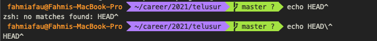
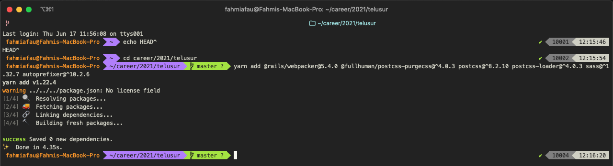

So today i learn that zsh on bare bones setting have this caret/(^) character filtered, causing can't execute command with that character. after some reading i came up with some solutions.  
First, we can use escape `(\)` before caret character like this

<div className="Image__Small">
  
</div>

or

Second, We can edit our zsh config file and add this command at the end of file. mine was located at ~/.zshrc .

```
setopt NO_NOMATCH
```

After that, restart zsh terminal and walaaa  
Now we can execute command with caret character.

<div className="Image__Small">
  
</div>

Thats all, hope it help :)
