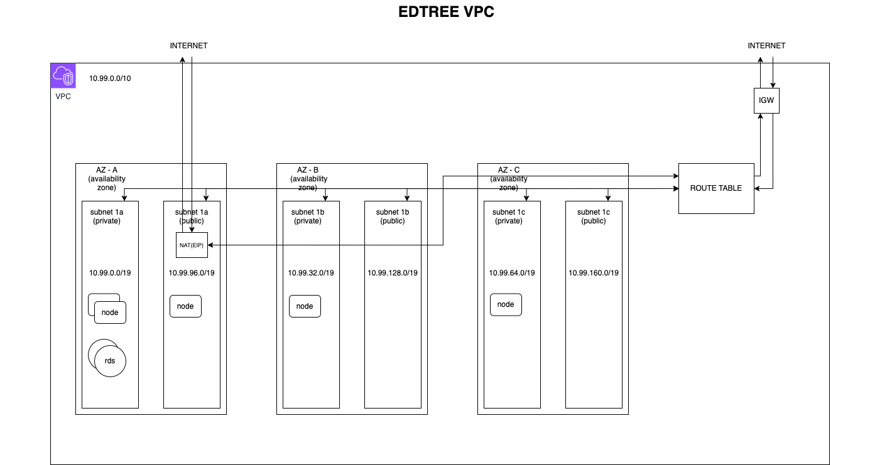

Before we deep dive into kubernetes and run anything inside AWS cloud, first we need to know how computer and other service talk to each other. The most common way on how computer talk to each other is through a network. VPC (virtual private cloud) is not that different from regular local network that we can setup at home, the difference is we try to make it virtually in cloud.

Then to make things easier for us, we will try to setup this using Terraform. Terraform is a tool to create infrastructure through code. Example, instead of manually setup using AWS's web interface (filling form, click here and there) it's better we try to compose it using code, this is why it called IaC (infrastructure as code). Besides it's easier to use, of course that's not the only advantage, i don't plan to list all advantages here now, that will be long and too far from our current topic. If you wish me to do that, i'm all ear :D.

In order to make us easier to imagine, i already draw our future network topology.

<div className="Image__Small">
  
</div>

Let me explain. Amount of AZ (availablity zone) in every region in aws is different, for region we use currently (ap-southeast-1) have 3: ap-southeast-1a, ap-southeast-1b, ap-southeast-1c. Here how to understand AZ, imagine in 1 data center there's 3 building and we try to bound it to one network so everything can be connected. Then in every AZ it will have 2 subnet, one private and the other one is public. If this is the first time you encounter something IP CIDR "10.99.0.0/19", don't worry.. it's just another way to define IP range. For example, 10.99.0.0/19 = 10.99.0.1 - 10.99.31.254, because IPV4 consist of 32 bit, "/19" in IP CIDR definition tell first 19 bit will be use as ip prefix. If my explanantion is a bit confusing, go ahead to this website https://cidr.xyz/ . Actually, the distribution of ip address in each subnet network is up to you, customize according to your need. I'll explain more while we code in terraform.

First create a folder, the name is up to you, but here i will use "terraform". Then create a file inside that folder with name "0-provider.tf", fill with this syntax

```terraform
terraform {
  required_version = "~> 1.0"

  required_providers {
    aws = {
      source  = "hashicorp/aws"
      version = "~> 5.0"
    }
  }
}

provider "aws" {
  region  = "ap-southeast-1"
  profile = "XXXXXXXX"
}

```

Explanation, here we define our requirement and every provider that will be use. For explanation every attribute we can use in aws provider, you can go to the documentation here https://registry.terraform.io/providers/hashicorp/aws/latest/docs .

Create another file with name "variables.tfvars", fill with this syntax

```terraform
variable "cluster_name" {
  default = "edtree"
}
```

Explanation, this file containing any variable that will be use in resource definition later in terraform.

Create another file with name "1-vpc.tf", fill with this syntax

```terraform
resource "aws_vpc" "edtree-vpc" {
  cidr_block = "10.99.0.0/16"

  # Must be enabled for EFS
  enable_dns_support   = true
  enable_dns_hostnames = true

  tags = {
    Name = "${var.cluster_name}-vpc"
  }
}
```

Explanation, here's how we define a resource using AWS provider that we define previously in "0-provider.tf" file. Here we instruct terraform to make a resource named aws_vpc with name "edtree-vpc", also there's a tag with attribute "Name", that tag with attribute name will be the name of our VPC in AWS. For name that we define after calling resource "aws_vpc", we can call it in another resource, for example with definition above, we can call this way aws_vpc.edtree-vpc.

Create another file with name "2-igw.tf", then fill with this syntax

```terraform
resource "aws_internet_gateway" "igw" {
  vpc_id = aws_vpc.edtree-vpc.id

  tags = {
    Name = "igw"
  }
}
```

Explanation, igw (internet gateway) like the name, the purpose of this resource is to expose our service so it can be accessed from internet or out side our VPC.

Create another file with name "3-subnets.tf", and fill with this syntax

```terraform
resource "aws_subnet" "private-ap-southeast-1a" {
  vpc_id            = aws_vpc.edtree-vpc.id
  cidr_block        = "10.99.0.0/19"
  availability_zone = "ap-southeast-1a"

  tags = {
    "Name"                                      = "private-ap-southeast-1a"
    "kubernetes.io/role/internal-elb"           = "1"
    "clusterName"                               = var.cluster_name
    "kubernetes.io/cluster/${var.cluster_name}" = "owned"
  }
}

resource "aws_subnet" "private-ap-southeast-1b" {
  vpc_id            = aws_vpc.edtree-vpc.id
  cidr_block        = "10.99.32.0/19"
  availability_zone = "ap-southeast-1b"

  tags = {
    "Name"                                      = "private-ap-southeast-1b"
    "kubernetes.io/role/internal-elb"           = "1"
    "clusterName"                               = var.cluster_name
    "kubernetes.io/cluster/${var.cluster_name}" = "owned"
  }
}

resource "aws_subnet" "private-ap-southeast-1c" {
  vpc_id            = aws_vpc.edtree-vpc.id
  cidr_block        = "10.99.64.0/19"
  availability_zone = "ap-southeast-1c"

  tags = {
    "Name"                                      = "private-ap-southeast-1c"
    "kubernetes.io/role/internal-elb"           = "1"
    "clusterName"                               = var.cluster_name
    "kubernetes.io/cluster/${var.cluster_name}" = "owned"
  }
}

resource "aws_subnet" "public-ap-southeast-1a" {
  vpc_id                  = aws_vpc.edtree-vpc.id
  cidr_block              = "10.99.96.0/19"
  availability_zone       = "ap-southeast-1a"
  map_public_ip_on_launch = true

  tags = {
    "Name"                                      = "public-ap-southeast-1a"
    "kubernetes.io/role/elb"                    = "1"
    "clusterName"                               = var.cluster_name
    "kubernetes.io/cluster/${var.cluster_name}" = "owned"
  }
}

resource "aws_subnet" "public-ap-southeast-1b" {
  vpc_id                  = aws_vpc.edtree-vpc.id
  cidr_block              = "10.99.128.0/19"
  availability_zone       = "ap-southeast-1b"
  map_public_ip_on_launch = true

  tags = {
    "Name"                                      = "public-ap-southeast-1b"
    "kubernetes.io/role/elb"                    = "1"
    "clusterName"                               = var.cluster_name
    "kubernetes.io/cluster/${var.cluster_name}" = "owned"
  }
}

resource "aws_subnet" "public-ap-southeast-1c" {
  vpc_id                  = aws_vpc.edtree-vpc.id
  cidr_block              = "10.99.160.0/19"
  availability_zone       = "ap-southeast-1c"
  map_public_ip_on_launch = true

  tags = {
    "Name"                                      = "public-ap-southeast-1c"
    "kubernetes.io/role/elb"                    = "1"
    "clusterName"                               = var.cluster_name
    "kubernetes.io/cluster/${var.cluster_name}" = "owned"
  }
}
```

Explanation, here we create subnets resource in every AZ, every AZ have 2 type of subnet, one is private network and another one is public network. For tags, don't worry to much, it's just requirement for aws ALB (amazon load balancer) and EKS (Elastic kubernetes service).

Create anoher file with name "4-nat.tf", and then fill with this syntax

```terraform
resource "aws_eip" "nat" {
  domain = "vpc"

  tags = {
    Name = "nat"
  }
}

resource "aws_nat_gateway" "nat" {
  allocation_id = aws_eip.nat.id
  subnet_id     = aws_subnet.public-ap-southeast-1a.id

  tags = {
    Name = "nat"
  }

  depends_on = [aws_internet_gateway.igw]
}
```

Explanation, this syntax aims to create resource eip (elastic ip) which then connected with nat gateway. Nat gateway aims to every service that run inside private subnet network can access internet but can't be accessed from internet.

Create another file with name "5-routes.tf", and fill with this syntax

```terraform
resource "aws_route_table" "private" {
  vpc_id = aws_vpc.edtree-vpc.id

  route {
    cidr_block     = "0.0.0.0/0"
    nat_gateway_id = aws_nat_gateway.nat.id
  }

  tags = {
    Name = "private"
  }
}

resource "aws_route_table" "public" {
  vpc_id = aws_vpc.edtree-vpc.id

  route {
    cidr_block = "0.0.0.0/0"
    gateway_id = aws_internet_gateway.igw.id
  }

  tags = {
    Name = "public"
  }
}

resource "aws_route_table_association" "private-ap-southeast-1a" {
  subnet_id      = aws_subnet.private-ap-southeast-1a.id
  route_table_id = aws_route_table.private.id
}

resource "aws_route_table_association" "private-ap-southeast-1b" {
  subnet_id      = aws_subnet.private-ap-southeast-1b.id
  route_table_id = aws_route_table.private.id
}

resource "aws_route_table_association" "private-ap-southeast-1c" {
  subnet_id      = aws_subnet.private-ap-southeast-1c.id
  route_table_id = aws_route_table.private.id
}

resource "aws_route_table_association" "public-ap-southeast-1a" {
  subnet_id      = aws_subnet.public-ap-southeast-1a.id
  route_table_id = aws_route_table.public.id
}

resource "aws_route_table_association" "public-ap-southeast-1b" {
  subnet_id      = aws_subnet.public-ap-southeast-1b.id
  route_table_id = aws_route_table.public.id
}

resource "aws_route_table_association" "public-ap-southeast-1c" {
  subnet_id      = aws_subnet.public-ap-southeast-1c.id
  route_table_id = aws_route_table.public.id
}
```

Explanation, we create route table resource. Route table servers to connect every subnet network that we create before to:

1. Internet gateway if subnet network intended as public (the one that can be accessed from internet and access internet)
2. Nat gateway if subnet network intended as private (the one that can access internet but not accessible from outside)

And then, we can try to run this command "terraform plan", that command will show output about any resource that will be added to our aws cloud. Once we are sure, we can run another command "terraform apply" and then wait untill process is done. Taraaa.. our vpc sucessfully created and ready to use. Then if we want to delete our resource completly, we can run this command "terraform destroy", sophisticated isn't it?. That's all for now, next if i have another chance, i want to deep dive kubernetes and other technologies. If you reach this far, thank you!
